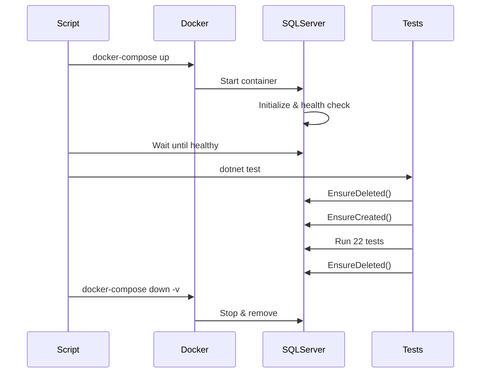

# Guia de Testes de Integração

## Visão Geral

Os testes de integração utilizam **SQL Server real** rodando em container Docker, garantindo que os testes sejam executados em um ambiente o mais próximo possível da produção.

## Pré-requisitos

- **Docker Desktop** instalado e rodando
- **.NET 9.0 SDK** instalado
- **8GB RAM disponível** (recomendado)

## Arquitetura dos Testes

### Estratégia

- ✅ **SQL Server real** em container Docker
- ✅ Banco de dados isolado por execução de testes
- ✅ Setup e cleanup automáticos via `IAsyncLifetime`
- ✅ Testes end-to-end completos
- ✅ Validação de comportamento real do EF Core

### Componentes

1. **docker-compose.test.yml**: Configuração do SQL Server para testes
2. **CustomWebApplicationFactory**: Factory que configura banco de teste
3. **run-integration-tests.ps1**: Script automatizado de execução

## Executando os Testes

### Método Rápido (Recomendado)

```powershell
.\run-integration-tests.ps1
```

Este script:
1. ✓ Verifica se Docker está rodando
2. ✓ Inicia SQL Server container
3. ✓ Aguarda SQL Server ficar pronto
4. ✓ Executa todos os testes de integração
5. ✓ Para e remove containers automaticamente

### Método Manual

#### 1. Iniciar SQL Server

```powershell
docker-compose -f docker-compose.test.yml up -d
```

#### 2. Aguardar SQL Server ficar pronto

```powershell
# Verificar status de saúde
docker inspect --format='{{.State.Health.Status}}' sqlserver-test
```

Aguarde até o status ser `healthy` (geralmente 15-30 segundos).

#### 3. Executar testes

```powershell
dotnet test --filter "FullyQualifiedName~Integration" --verbosity normal
```

#### 4. Parar SQL Server

```powershell
docker-compose -f docker-compose.test.yml down -v
```

## Estrutura dos Testes

```
Tests/TaskManager.TasksService.Tests/Integration/
└── TasksApiIntegrationTests.cs
    ├── CustomWebApplicationFactory (IAsyncLifetime)
    │   ├── InitializeAsync() - Cria banco limpo
    │   └── DisposeAsync() - Remove banco após testes
    └── 22 testes end-to-end
        ├── GET Tests (6)
        ├── POST Tests (4)
        ├── PUT Tests (4)
        ├── DELETE Tests (3)
        └── Complex Scenarios (5)
```

## Configuração do Banco de Dados

### Connection String de Teste

```
Server=localhost,1433;
Database=TasksTestDb;
User Id=sa;
Password=YourStrong@Passw0rd;
TrustServerCertificate=True;
MultipleActiveResultSets=true
```

### Credenciais SQL Server

- **Usuário**: `sa`
- **Senha**: `YourStrong@Passw0rd`
- **Porta**: `1433`

⚠️ **Atenção**: Estas credenciais são apenas para ambiente de teste local!

## Recursos do SQL Server Container

```yaml
Image: mcr.microsoft.com/mssql/server:2022-latest
Memory: ~2GB (alocado automaticamente)
CPU: Compartilhado
Storage: Volume Docker persistente (limpo após testes)
```

## Ciclo de Vida dos Testes



## Troubleshooting

### ❌ Erro: "Docker não está rodando"

**Solução**: 
```powershell
# Abrir Docker Desktop e aguardar inicialização
```

### ❌ Erro: "Porta 1433 já está em uso"

**Solução**: 
```powershell
# Parar SQL Server local ou mudar porta no docker-compose.test.yml
# Exemplo: "1434:1433"
```

### ❌ Erro: "Timeout ao conectar SQL Server"

**Solução**: 
```powershell
# Verificar logs do container
docker logs sqlserver-test

# Reiniciar container
docker-compose -f docker-compose.test.yml restart
```

### ❌ Erro: "A network-related or instance-specific error"

**Solução**: 
```powershell
# Parar todos os containers de teste
docker-compose -f docker-compose.test.yml down -v

# Limpar volumes órfãos
docker volume prune -f

# Reiniciar Docker Desktop
```

## CI/CD Integration

### GitHub Actions

```yaml
name: Integration Tests

on: [push, pull_request]

jobs:
  integration-tests:
    runs-on: ubuntu-latest
    
    services:
      sqlserver:
        image: mcr.microsoft.com/mssql/server:2022-latest
        env:
          ACCEPT_EULA: Y
          SA_PASSWORD: YourStrong@Passw0rd
        ports:
          - 1433:1433
        options: >-
          --health-cmd "/opt/mssql-tools/bin/sqlcmd -S localhost -U sa -P YourStrong@Passw0rd -Q 'SELECT 1'"
          --health-interval 10s
          --health-timeout 3s
          --health-retries 10
    
    steps:
      - uses: actions/checkout@v4
      
      - name: Setup .NET
        uses: actions/setup-dotnet@v4
        with:
          dotnet-version: '9.0.x'
      
      - name: Restore dependencies
        run: dotnet restore
      
      - name: Build
        run: dotnet build --no-restore
      
      - name: Run Integration Tests
        run: dotnet test --filter "FullyQualifiedName~Integration" --no-build --verbosity normal
```

## Comparação: InMemory vs SQL Server Real

| Aspecto | InMemory | SQL Server Real |
|---------|----------|-----------------|
| **Velocidade** | ⚡ Muito rápido (~1s) | 🐢 Moderado (~5s) |
| **Realismo** | ❌ Comportamento diferente | ✅ Idêntico à produção |
| **Validação EF** | ❌ Não valida SQL gerado | ✅ Valida queries reais |
| **Constraints** | ❌ Não valida | ✅ Valida tudo |
| **Transactions** | ⚠️ Limitado | ✅ Completo |
| **Isolation** | ✅ Por instância | ✅ Por banco de dados |
| **CI/CD** | ✅ Simples | ⚠️ Requer container |
| **Recomendação** | Testes unitários | ✅ **Testes de integração** |

## Métricas dos Testes

### Cobertura Esperada

- **Endpoints**: 100% (5/5)
- **Operações CRUD**: 100%
- **Validações**: 100%
- **Cenários Complexos**: Completo

### Performance Esperada

- **Setup (Docker + SQL)**: ~20-30s (primeira vez)
- **Execução dos Testes**: ~5-10s
- **Cleanup**: ~2-3s
- **Total**: ~30-45s

## Boas Práticas

✅ **Execute antes de commits**: Garante que não há regressões
✅ **Use script automatizado**: Evita erros manuais
✅ **Monitore logs Docker**: Ajuda no troubleshooting
✅ **Limpe volumes regularmente**: `docker volume prune -f`
✅ **Atualize SQL Server**: Use sempre latest stable image

## Próximos Passos

1. ✅ Implementar testes de integração para StatisticsService
2. ✅ Adicionar testes de carga/stress
3. ✅ Configurar code coverage reporting
4. ✅ Adicionar testes de segurança
5. ✅ Implementar testes de migração de schema

## Referências

- [ASP.NET Core Integration Tests](https://learn.microsoft.com/en-us/aspnet/core/test/integration-tests)
- [SQL Server Docker](https://hub.docker.com/_/microsoft-mssql-server)
- [xUnit IAsyncLifetime](https://xunit.net/docs/shared-context#async-lifetime)
- [Entity Framework Core Testing](https://learn.microsoft.com/en-us/ef/core/testing/)
